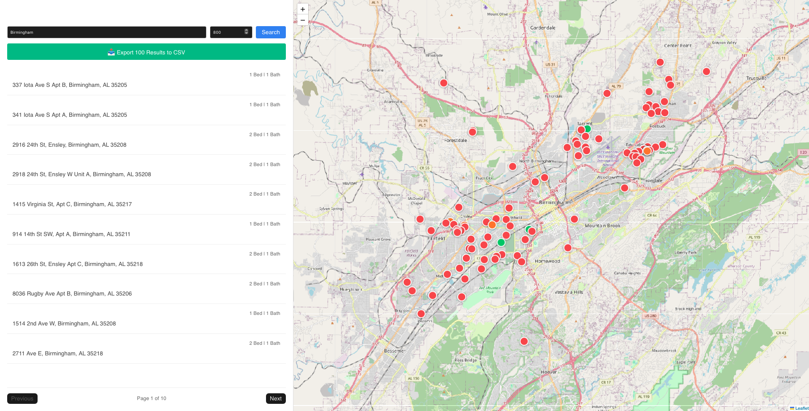

# 🏠 BHAM Rentals Finder



A full-stack Single Page Application designed to help users find affordable rental properties throughout the Birmingham area. It pulls live, long-term rental data and visually plots it on an interactive map, color-coding listings by price to instantly highlight the best deals.

## ✨ Features

- **Interactive Heat Map:** Uses Leaflet to plot apartments. Pins are dynamically color-coded based on affordability (Green for steals, Orange for moderate, Red for pushing the budget).
- **Hover Interactions:** Hovering over an apartment in the sidebar instantly highlights and brings the corresponding map pin to the front.
- **Instant Caching:** The Node.js backend uses in-memory caching to save API calls and serve recent searches in milliseconds.
- **CSV Export:** Download your customized, filtered list of apartments directly to a spreadsheet for easy tracking and apartment hunting.
- **Client-Side Pagination:** Seamlessly scroll through hundreds of listings in the sidebar without losing the bird's-eye view of the map.

## 🛠️ Tech Stack

- **Frontend:** React (scaffolded with Vite), Axios, React-Leaflet
- **Backend:** Node.js, Express, Axios, Node-Cache, CORS, Dotenv
- **Data Provider:** [RentCast API](https://rentcast.io/api)

---

## 🚀 Getting Started

Follow these instructions to get a copy of the project up and running on your local machine.

### Prerequisites

1. **Node.js** installed on your machine.
2. A free API key from **RentCast**.

### 1. Backend Setup

The backend handles the API requests to RentCast and caches the results to ensure lightning-fast load times and save API credits.

1. Open a terminal and navigate to the backend directory:

   ```bash
   cd backend
   ```

2. Install the required dependencies:

   ```bash
   npm install
   ```

3. Create a hidden environment file:

- Create a file named `.env` in the `backend/` folder.
- Add the following lines, replacing the placeholder with your actual RentCast API key:

  ```env
  RENTAL_API_KEY=your_actual_api_key_here
  PORT=3000
  ```

4. Start the backend server:

   ```bash
   npm run dev
   ```

_You should see a message confirming the server is running on `http://localhost:3000`._

### 2. Frontend Setup

The frontend is a Vite-powered React application that handles the UI, mapping, and data presentation.

1. Open a **new** terminal window/tab and navigate to the frontend directory:

   ```bash
   cd frontend
   ```

2. Install the required dependencies:

   ```bash
   npm install
   ```

3. Start the Vite development server:

   ```bash
   npm run dev
   ```

_Vite will provide a local host URL (usually `http://localhost:5173`). Open this link in your browser._

---

## 💡 Usage Guide

1. **Search:** Enter your target city (e.g., "Birmingham") and your absolute maximum budget (e.g., "850").
2. **Browse:** Use the pagination controls at the bottom of the left sidebar to scroll through the list.
3. **Locate:** Hover over any listing in the sidebar to watch its corresponding pin pop on the map.
4. **Export:** Click the green "Export to CSV" button to download your current search results into a spreadsheet.

## ⚠️ Important Notes

- **API Rate Limits:** The free tier of RentCast allows for 50 requests per month. The built-in backend caching (which stores data for 2 hours) is specifically designed to stretch those free credits as far as possible.
- **Missing Map Pins:** Occasionally, landlords upload listings without valid coordinates. The backend automatically filters these out to prevent the map from crashing.
